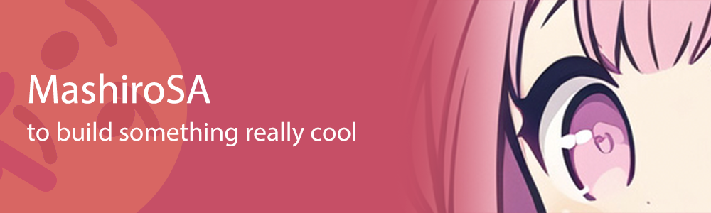

<!-- head para -->
<!--
# MashiroSA -> 😊
-->

   

<!-- markdown start -->
### 👋 Hola

- I am a student of clinical medicine, insisting on living and learning! Recently I have been very busy, so I may not be online as so often!

- If you have any problem or question, feel free to ask me!

- As a fact, I'm not a computer science student. But I'm interested in Programming, AI and so on. I'm trying to learn from all one of you in Github and I may occur some issues on project or make mistakes. I do really apologize for that. Please don't get mad on me. ( •ᴗ• )

### 🐍 Contribution Stats

<!-- status of visitor -->
### ✨ Visitor Stats

  

<!-- status of github -->
### 🔢 Github Stats 

  
  

    
<!-- status of work -->
### 🐟 Work Work...

  <table>
    <tr>
      <td valign="mid" width="50%">
        
      </td>
    </tr>
  </table>

<!-- ### 🔧 My Skill Set

  

    
    
    
    
    
    
    
    
    
  

 -->

<!-- activities -->
### 🚌 Activities

<!-- footer -->

  
  Designed by Chitsanfei0v0
  

